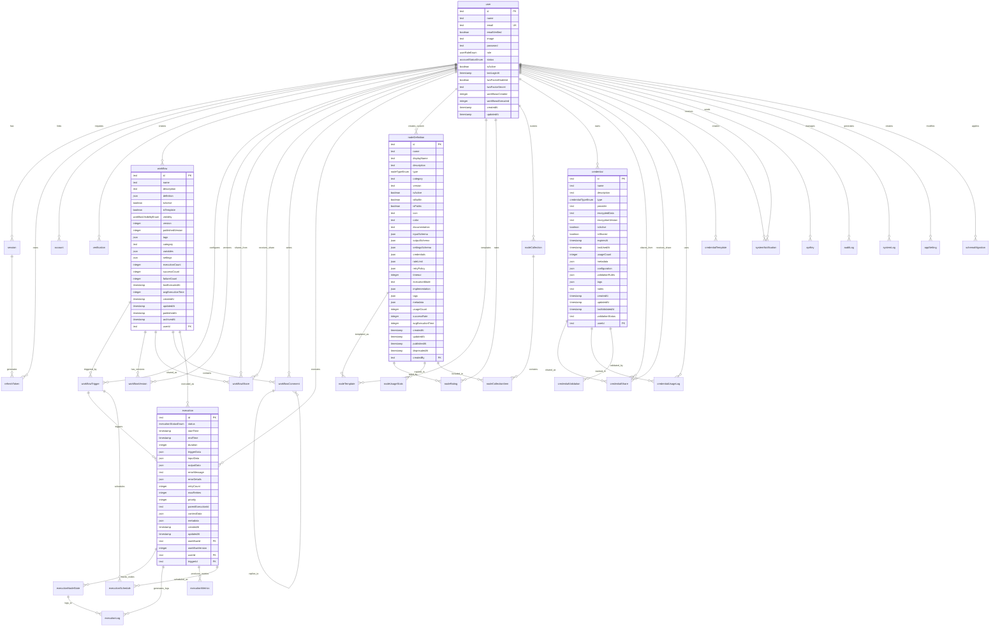
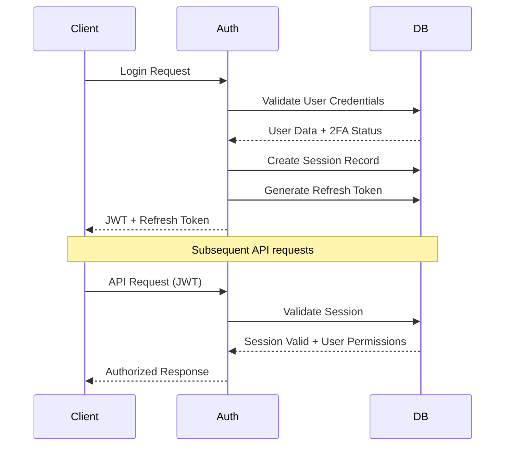
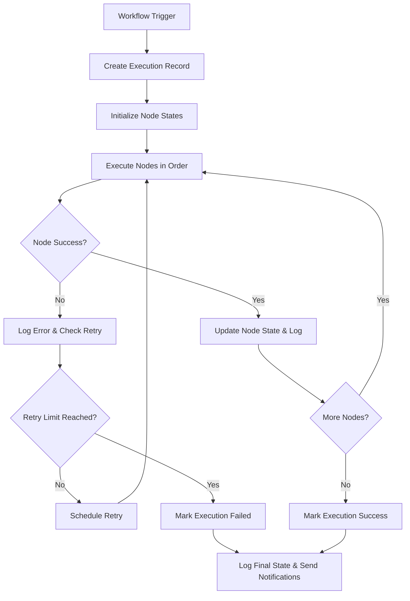
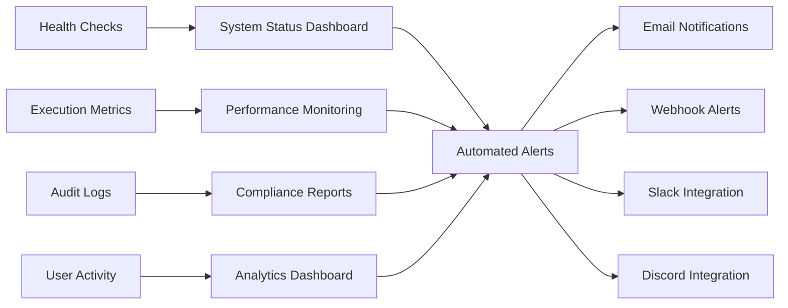
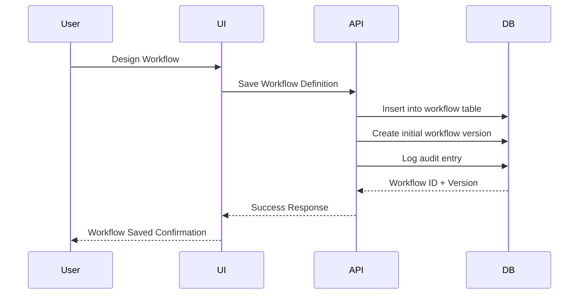
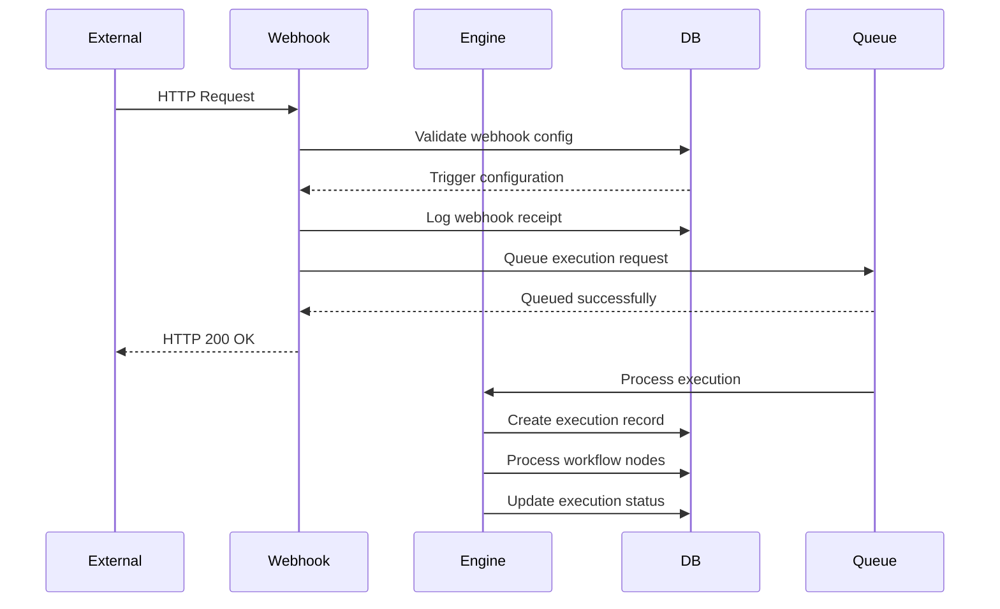
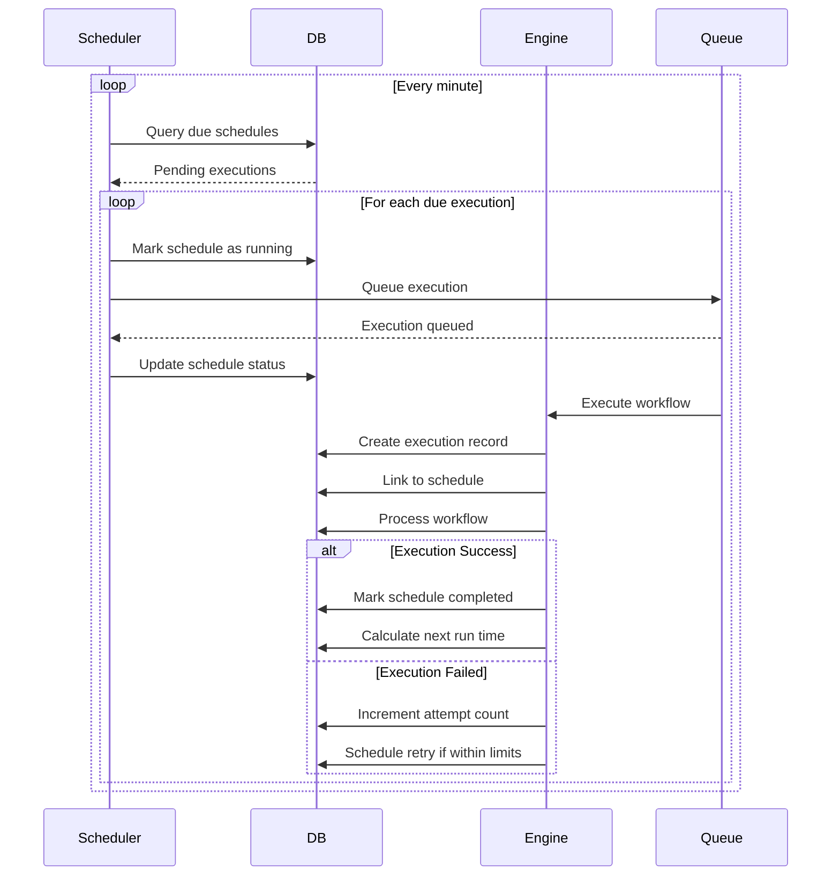
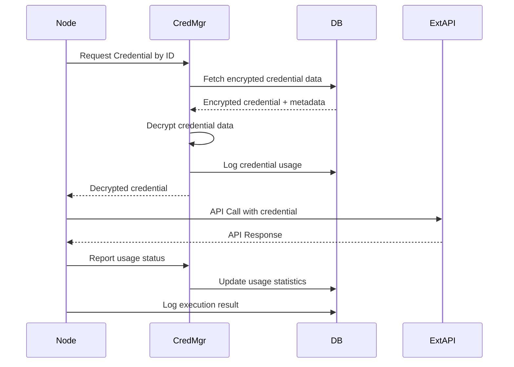

# A2N Database Architecture & Documentation

## Overview

This document provides a comprehensive analysis of the A2N workflow automation platform database schema, including detailed Entity-Relationship diagrams and explanations of how the database supports all core features of the platform. The database is designed using PostgreSQL with Drizzle ORM, ensuring type safety, scalability, and robust data integrity.

## Database Architecture

The A2N database follows a modular design pattern with distinct domains:

- **Authentication & User Management**: User accounts, sessions, and security
- **Workflow Management**: Workflow definitions, versions, and collaboration
- **Execution Engine**: Runtime execution tracking and comprehensive logging  
- **Node System**: Plugin architecture for extensible workflow nodes
- **Credential Management**: Secure storage of API keys and authentication tokens
- **System Operations**: Health monitoring, settings, and comprehensive audit trails

## Complete Entity Relationship Diagram



## Feature Support Analysis

### 1. User Authentication & Authorization

**Supported Features:**
- Multi-factor authentication with TOTP support via `twoFactorEnabled` and `twoFactorSecret`
- Session management with refresh tokens and IP tracking
- OAuth integration for third-party providers via `account` table
- Role-based access control (USER, ADMIN, OWNER) via `userRoleEnum`
- Account status management (ACTIVE, SUSPENDED, DELETED) via `accountStatusEnum`
- Email verification and password reset workflows via `verification` table

**Database Implementation:**
- `user` table: Core user information with encrypted passwords and 2FA support
- `session` table: Active user sessions with IP and user agent tracking
- `refreshToken` table: JWT refresh tokens with revocation capabilities
- `account` table: Links external OAuth providers (Google, GitHub, etc.)
- `verification` table: Handles email verification, password reset, and 2FA tokens



### 2. Visual Workflow Builder

**Supported Features:**
- Drag-and-drop workflow creation with JSON schema storage
- Node positioning and connections via `definition` JSON field
- Comprehensive workflow versioning via `workflowVersion` table
- Real-time collaboration with threaded comments via `workflowComment`
- Permission-based workflow sharing via `workflowShare`
- Category-based organization and template system
- Workflow statistics and performance tracking

**Database Implementation:**
- `workflow` table: Complete workflow definition stored as JSON with metadata
- `workflowVersion` table: Version history with change logs and publishing status
- `workflowShare` table: Permission-based sharing (VIEW, EDIT, EXECUTE, ADMIN)
- `workflowComment` table: Threaded comments with node-specific references
- JSON schema ensures workflow integrity and supports complex node configurations

**Workflow Definition Structure:**
```json
{
  "nodes": [
    {
      "id": "node_1",
      "type": "http_request",
      "position": { "x": 100, "y": 100 },
      "config": {
        "url": "https://api.example.com",
        "method": "GET",
        "headers": {},
        "timeout": 30000
      },
      "credentials": ["credential_id_1"]
    }
  ],
  "connections": [
    {
      "source": "node_1",
      "target": "node_2",
      "sourceHandle": "output",
      "targetHandle": "input"
    }
  ],
  "variables": {
    "global": {"api_base": "https://api.example.com"},
    "workflow": {"retry_count": 3}
  },
  "settings": {
    "timeout": 300000,
    "retryPolicy": {
      "enabled": true,
      "maxRetries": 3,
      "retryDelay": 1000
    },
    "notifications": {
      "onSuccess": false,
      "onFailure": true,
      "channels": ["email", "slack"]
    }
  }
}
```

### 3. Workflow Execution Engine

**Supported Features:**
- Multiple trigger types (Manual, Webhook, Schedule, Event) via `workflowTrigger`
- Real-time execution monitoring with detailed status tracking
- Node-level execution tracking via `executionNodeState`
- Comprehensive retry mechanisms with backoff strategies
- Execution metrics and performance monitoring via `executionMetrics`
- Parallel and sequential execution support with priority queuing
- Detailed execution logging at multiple levels via `executionLog`
- Scheduled execution management via `executionSchedule`

**Database Implementation:**
- `execution` table: Workflow runs with status, timing, and comprehensive metadata
- `executionNodeState` table: Individual node execution tracking with progress
- `executionLog` table: Multi-level logging (DEBUG, INFO, WARN, ERROR, FATAL)
- `executionMetrics` table: Performance data collection and analysis
- `executionSchedule` table: Scheduled workflow runs with retry logic



### 4. Plugin Architecture (Nodes)

**Supported Features:**
- Built-in and custom node types with comprehensive schemas
- Node marketplace with community ratings and reviews via `nodeRating`
- Template system for common configurations via `nodeTemplate`
- Usage analytics and performance tracking via `nodeUsageStats`
- Node collections for organization via `nodeCollection` and `nodeCollectionItem`
- Versioning and deprecation management
- Support for multiple execution modes (SYNC, ASYNC, STREAM)
- Multiple runtime implementations (NODE, PYTHON, DOCKER, WEBHOOK)

**Database Implementation:**
- `nodeDefinition` table: Complete node specifications with JSON schemas
- `nodeTemplate` table: Pre-configured node setups for common use cases
- `nodeRating` table: Community feedback and rating system
- `nodeUsageStats` table: Daily aggregated usage and performance metrics
- `nodeCollection` table: Curated node collections for easy discovery

**Node Schema Example:**
```json
{
  "inputSchema": {
    "type": "object",
    "properties": {
      "url": {
        "type": "string",
        "description": "API endpoint URL",
        "required": true,
        "format": "uri"
      },
      "method": {
        "type": "string",
        "enum": ["GET", "POST", "PUT", "DELETE"],
        "default": "GET"
      },
      "headers": {
        "type": "object",
        "additionalProperties": {"type": "string"}
      }
    },
    "required": ["url"]
  },
  "outputSchema": {
    "type": "object",
    "properties": {
      "response": {
        "type": "object",
        "description": "API response data"
      },
      "statusCode": {
        "type": "number",
        "description": "HTTP status code"
      },
      "headers": {
        "type": "object",
        "description": "Response headers"
      }
    }
  },
  "credentials": {
    "required": false,
    "types": ["API_KEY", "OAUTH", "BASIC_AUTH"],
    "description": "Authentication for API requests"
  }
}
```

### 5. Credential Management System

**Supported Features:**
- Multiple credential types (OAuth, API Key, Basic Auth, Certificates, SSH Keys)
- AES-256 encryption with version support for key rotation
- Secure credential sharing with permission controls via `credentialShare`
- Automatic validation and expiration tracking via `credentialValidation`
- Comprehensive usage logging and audit trails via `credentialUsageLog`
- Template system for common credential types via `credentialTemplate`
- Usage limits and monitoring for shared credentials

**Database Implementation:**
- `credential` table: Encrypted credential data with comprehensive metadata
- `credentialShare` table: Permission-based sharing with usage limits
- `credentialUsageLog` table: Complete audit trail of credential usage
- `credentialTemplate` table: Setup guidance for different credential types
- `credentialValidation` table: Automated credential health monitoring

**Security Features:**
- Encryption at rest with key rotation support via `encryptionVersion`
- Comprehensive usage tracking for security auditing
- Automatic expiration handling with validation rules
- IP-based access restrictions via metadata
- Secure sharing with time-limited access and usage quotas

### 6. Comprehensive Monitoring & System Management

**Supported Features:**
- System health monitoring via `healthCheck` table
- Application performance metrics and alerting
- Comprehensive user activity tracking via `auditLog`
- Automated notifications and alerting via `systemNotification`
- API key management for external access via `apiKey`
- Configurable application settings via `appSetting`
- Schema migration tracking via `schemaMigration`
- Comprehensive system logging via `systemLog`

**Database Implementation:**
- `healthCheck` table: Service monitoring with configurable checks and alerting
- `systemLog` table: Application event logging with correlation IDs
- `auditLog` table: Complete user action tracking for compliance
- `systemNotification` table: Multi-channel notification management
- `apiKey` table: Secure external API access with rate limiting and IP restrictions



## Data Flow Architecture

### 1. Workflow Creation Flow



### 2. Workflow Execution Flow

```mermaid
sequenceDiagram
    participant Trigger
    participant Engine
    participant DB
    participant Node
    participant CredMgr
    
    Trigger->>Engine: Start Execution Request
    Engine->>DB: Create execution record
    Engine->>DB: Initialize node states
    
    loop For each node in workflow
        Engine->>CredMgr: Request Credentials (if needed)
        CredMgr->>DB: Fetch encrypted credentials
        CredMgr-->>Engine: Decrypted credentials
        Engine->>Node: Execute with inputs + credentials
        Node-->>Engine: Return outputs/error
        Engine->>DB: Update node state
        Engine->>DB: Log execution details
        Engine->>DB: Record metrics
        Engine->>DB: Log credential usage
    end
    
    Engine->>DB: Complete execution
    Engine->>DB: Update workflow statistics
    Engine->>DB: Send notifications (if configured)

### 4. Node Marketplace & Rating Flow

```mermaid
sequenceDiagram
    participant User
    participant UI
    participant API
    participant DB
    participant Analytics
    
    User->>UI: Browse Node Marketplace
    UI->>API: Get Available Nodes
    API->>DB: Query nodeDefinition + ratings
    DB-->>API: Node list with ratings
    API-->>UI: Formatted node data
    
    User->>UI: Install/Use Node
    UI->>API: Add Node to Workflow
    API->>DB: Update node usage stats
    API->>Analytics: Track node adoption
    
    User->>UI: Rate Node
    UI->>API: Submit Rating
    API->>DB: Insert/Update nodeRating
    API->>DB: Recalculate average rating
    API-->>UI: Rating saved
```

### 5. Webhook Trigger Flow



### 6. Scheduled Execution Flow


```

### 3. Credential Usage Flow



## Performance Optimization

### Indexing Strategy

**Primary Indexes:**
- User lookup: `(email)`, `(is_active)`, `(role)`
- Workflow queries: `(user_id, is_active)`, `(visibility)`, `(category)`
- Execution tracking: `(workflow_id, status)`, `(start_time)`, `(user_id)`
- Node performance: `(type, category)`, `(is_active)`, `(is_public)`
- Credential access: `(user_id, type)`, `(is_active)`, `(expires_at)`
- System monitoring: `(service_name, status)`, `(timestamp)`

**Composite Indexes:**
- Execution history: `(user_id, workflow_id, start_time)`
- Log queries: `(execution_id, timestamp, level)`
- Usage analytics: `(node_definition_id, date)`
- Audit trail: `(user_id, action, timestamp)`
- Health monitoring: `(service_name, next_check_at)`

### Query Optimization Examples

```sql
-- Optimized execution history query
CREATE INDEX idx_execution_history 
ON execution(user_id, workflow_id, start_time DESC);

-- Optimized log search
CREATE INDEX idx_execution_logs_search 
ON execution_log(execution_id, timestamp DESC, level);

-- Optimized node usage statistics
CREATE INDEX idx_node_usage_analytics 
ON node_usage_stats(node_definition_id, date DESC);

-- Optimized credential expiration checks
CREATE INDEX idx_credential_expiration 
ON credential(expires_at) 
WHERE expires_at IS NOT NULL AND is_active = true;
```

### Advanced Query Optimization

**Partial Indexes for Common Queries:**
```sql
-- Index only active workflows for faster filtering
CREATE INDEX idx_workflow_active_only 
ON workflow(user_id, name) 
WHERE is_active = true;

-- Index only failed executions for error analysis
CREATE INDEX idx_execution_failures 
ON execution(workflow_id, start_time DESC) 
WHERE status IN ('FAILED', 'CANCELLED');

-- Index only shared credentials
CREATE INDEX idx_credential_shared 
ON credential(type, provider) 
WHERE is_shared = true AND is_active = true;
```

**Materialized Views for Analytics:**
```sql
-- Daily execution statistics
CREATE MATERIALIZED VIEW daily_execution_stats AS
SELECT 
  DATE(start_time) as execution_date,
  COUNT(*) as total_executions,
  COUNT(CASE WHEN status = 'SUCCESS' THEN 1 END) as successful_executions,
  COUNT(CASE WHEN status = 'FAILED' THEN 1 END) as failed_executions,
  AVG(duration) as avg_duration,
  COUNT(DISTINCT user_id) as unique_users,
  COUNT(DISTINCT workflow_id) as unique_workflows
FROM execution 
WHERE start_time >= CURRENT_DATE - INTERVAL '90 days'
GROUP BY DATE(start_time);

-- Refresh daily at midnight
CREATE OR REPLACE FUNCTION refresh_daily_stats()
RETURNS void AS $$
BEGIN
  REFRESH MATERIALIZED VIEW CONCURRENTLY daily_execution_stats;
END;
$$ LANGUAGE plpgsql;
```

### Advanced Security Measures

**Input Validation & Sanitization:**
```typescript
// Comprehensive input validation
interface SecurityValidation {
  // Workflow definition validation
  validateWorkflowDefinition(definition: any): ValidationResult {
    // Validate node types against whitelist
    // Check for malicious code injection
    // Verify schema compliance
    // Limit workflow complexity (max nodes, connections)
  },
  
  // User input sanitization
  sanitizeUserInput(input: string): string {
    // Remove script tags and dangerous HTML
    // Escape special characters
    // Validate against XSS patterns
  },
  
  // API parameter validation
  validateApiParams(params: Record<string, any>): ValidationResult {
    // Type checking
    // Range validation
    // Pattern matching
    // SQL injection prevention
  }
}
```

**Rate Limiting Implementation:**
```sql
-- Track API usage per user/IP
CREATE TABLE api_rate_limit (
  id TEXT PRIMARY KEY,
  identifier TEXT NOT NULL, -- user_id or ip_address
  endpoint TEXT NOT NULL,
  request_count INTEGER DEFAULT 0,
  window_start TIMESTAMP NOT NULL,
  window_end TIMESTAMP NOT NULL,
  is_blocked BOOLEAN DEFAULT FALSE,
  created_at TIMESTAMP DEFAULT NOW()
);

CREATE INDEX idx_rate_limit_lookup 
ON api_rate_limit(identifier, endpoint, window_end);
```

**Credential Encryption Implementation:**
```typescript
// AES-256-GCM encryption for credentials
class CredentialEncryption {
  private readonly algorithm = 'aes-256-gcm';
  private readonly keyLength = 32;
  private readonly ivLength = 16;
  private readonly tagLength = 16;
  
  encrypt(data: string, masterKey: Buffer): EncryptedData {
    const iv = crypto.randomBytes(this.ivLength);
    const cipher = crypto.createCipher(this.algorithm, masterKey);
    cipher.setAAD(Buffer.from('credential-data'));
    
    let encrypted = cipher.update(data, 'utf8', 'hex');
    encrypted += cipher.final('hex');
    
    const tag = cipher.getAuthTag();
    
    return {
      encrypted,
      iv: iv.toString('hex'),
      tag: tag.toString('hex'),
      version: 'v2' // For key rotation
    };
  }
  
  decrypt(encryptedData: EncryptedData, masterKey: Buffer): string {
    const decipher = crypto.createDecipher(this.algorithm, masterKey);
    decipher.setAAD(Buffer.from('credential-data'));
    decipher.setAuthTag(Buffer.from(encryptedData.tag, 'hex'));
    
    let decrypted = decipher.update(encryptedData.encrypted, 'hex', 'utf8');
    decrypted += decipher.final('utf8');
    
    return decrypted;
  }
}
```

**Security Monitoring & Alerting:**
```sql
-- Security event tracking
CREATE TABLE security_event (
  id TEXT PRIMARY KEY,
  event_type TEXT NOT NULL, -- FAILED_LOGIN, SUSPICIOUS_API, DATA_BREACH, etc.
  severity TEXT NOT NULL DEFAULT 'MEDIUM', -- LOW, MEDIUM, HIGH, CRITICAL
  description TEXT NOT NULL,
  ip_address INET,
  user_agent TEXT,
  user_id TEXT REFERENCES "user"(id),
  resource_type TEXT, -- WORKFLOW, CREDENTIAL, USER, etc.
  resource_id TEXT,
  metadata JSONB,
  is_resolved BOOLEAN DEFAULT FALSE,
  resolved_at TIMESTAMP,
  resolved_by TEXT REFERENCES "user"(id),
  created_at TIMESTAMP DEFAULT NOW()
);

CREATE INDEX idx_security_event_type ON security_event(event_type);
CREATE INDEX idx_security_event_severity ON security_event(severity);
CREATE INDEX idx_security_event_unresolved ON security_event(is_resolved) 
WHERE is_resolved = FALSE;
```

**Data Privacy Compliance (GDPR/CCPA):**
```sql
-- User data deletion support
CREATE OR REPLACE FUNCTION anonymize_user_data(target_user_id TEXT)
RETURNS VOID AS $$
BEGIN
  -- Anonymize user record
  UPDATE "user" SET 
    name = 'Anonymous User',
    email = CONCAT('deleted_', target_user_id, '@anonymous.local'),
    image = NULL,
    password = NULL,
    two_factor_secret = NULL,
    is_active = FALSE,
    status = 'DELETED'
  WHERE id = target_user_id;
  
  -- Anonymize audit logs
  UPDATE audit_log SET 
    metadata = jsonb_set(
      COALESCE(metadata, '{}'),
      '{anonymized}',
      'true'
    )
  WHERE user_id = target_user_id;
  
  -- Delete personal data
  DELETE FROM session WHERE user_id = target_user_id;
  DELETE FROM refresh_token WHERE user_id = target_user_id;
  DELETE FROM verification WHERE identifier LIKE '%' || target_user_id || '%';
  
  -- Archive workflows (don't delete for business continuity)
  UPDATE workflow SET 
    name = CONCAT('Archived Workflow ', id),
    description = 'Workflow archived due to user deletion',
    is_active = FALSE,
    archived_at = NOW()
  WHERE user_id = target_user_id;
  
  RAISE NOTICE 'User data anonymized for user_id: %', target_user_id;
END;
$$ LANGUAGE plpgsql;
```

### Caching Strategy

**Redis Cache Implementation:**
```typescript
// Cache frequently accessed data
interface CacheStrategy {
  // User sessions - 1 hour TTL
  userSessions: {
    key: `session:${userId}`,
    ttl: 3600,
    data: SessionData
  },
  
  // Workflow definitions - 30 minutes TTL
  workflowDefinitions: {
    key: `workflow:${workflowId}`,
    ttl: 1800,
    data: WorkflowDefinition
  },
  
  // Node definitions - 24 hours TTL (rarely change)
  nodeDefinitions: {
    key: `node:${nodeType}`,
    ttl: 86400,
    data: NodeDefinition[]
  },
  
  // Execution status - 5 minutes TTL
  executionStatus: {
    key: `execution:${executionId}:status`,
    ttl: 300,
    data: ExecutionStatus
  }
}
```

**Database Connection Pool Optimization:**
```typescript
// Optimal pool configuration
const poolConfig = {
  // Connection pool sizing
  min: 5,  // Minimum connections
  max: 20, // Maximum connections
  
  // Connection lifecycle
  acquireTimeoutMillis: 30000,
  createTimeoutMillis: 30000,
  destroyTimeoutMillis: 5000,
  idleTimeoutMillis: 30000,
  reapIntervalMillis: 1000,
  createRetryIntervalMillis: 200,
  
  // Health checks
  testOnBorrow: true,
  testOnCreate: true,
  testQuery: 'SELECT 1'
};
```
```

## Security Architecture

### Data Protection

1. **Encryption at Rest**
   - Database-level encryption via PostgreSQL/NeonDB
   - Application-level encryption for credentials using AES-256
   - Encryption version tracking for key rotation

2. **Access Control**
   - Row-level security (RLS) for user data isolation
   - Role-based permissions with enum constraints
   - API key authentication with scope limitations

3. **Audit Trail**
   - Comprehensive audit logging for all user actions
   - IP address and user agent tracking
   - Correlation IDs for request tracing

### Example Security Policies

```sql
-- Row Level Security for user data isolation
CREATE POLICY user_workflow_isolation ON workflow 
  FOR ALL USING (user_id = current_user_id());

CREATE POLICY user_credential_isolation ON credential 
  FOR ALL USING (user_id = current_user_id());

-- Audit trigger for sensitive operations
CREATE OR REPLACE FUNCTION audit_trigger() 
RETURNS TRIGGER AS $$
BEGIN
  INSERT INTO audit_log (
    action, resource, resource_id, 
    old_values, new_values, user_id, timestamp
  ) VALUES (
    TG_OP, TG_TABLE_NAME, COALESCE(NEW.id, OLD.id),
    row_to_json(OLD), row_to_json(NEW), 
    current_user_id(), NOW()
  );
  RETURN COALESCE(NEW, OLD);
END;
$$ LANGUAGE plpgsql;
```

## Data Retention & Cleanup

### Retention Policies

- **Execution Data**: Success executions (90 days), Failed executions (180 days)
- **Logs**: Execution logs (30 days), System logs (90 days)
- **Audit Data**: Audit logs (2 years), Usage logs (1 year)
- **Metrics**: Node usage stats (1 year), Execution metrics (6 months)
- **Monitoring**: Health checks (30 days), Notifications (90 days)

### Automated Cleanup Jobs

```sql
-- Cleanup old successful executions
DELETE FROM execution 
WHERE status = 'SUCCESS' 
  AND end_time < NOW() - INTERVAL '90 days';

-- Cleanup old execution logs
DELETE FROM execution_log 
WHERE timestamp < NOW() - INTERVAL '30 days';

-- Cleanup old system logs
DELETE FROM system_log 
WHERE timestamp < NOW() - INTERVAL '90 days';

-- Archive old audit logs
INSERT INTO audit_log_archive 
SELECT * FROM audit_log 
WHERE timestamp < NOW() - INTERVAL '2 years';

DELETE FROM audit_log 
WHERE timestamp < NOW() - INTERVAL '2 years';
```

## Scalability Considerations

### Horizontal Scaling

1. **Read Replicas**: For analytics and reporting queries
2. **Connection Pooling**: Using PgBouncer for connection management
3. **Partitioning**: Large tables partitioned by date or user_id
4. **Caching**: Redis for frequently accessed data

### Vertical Scaling

1. **Resource Allocation**: CPU and memory optimization
2. **Storage**: NVMe SSDs for high IOPS requirements
3. **Network**: High-bandwidth connections for data transfer

### Performance Monitoring

```sql
-- Monitor slow queries
SELECT query, mean_time, calls, total_time
FROM pg_stat_statements 
ORDER BY mean_time DESC 
LIMIT 10;

-- Monitor index usage
SELECT schemaname, tablename, indexname, idx_scan, idx_tup_read
FROM pg_stat_user_indexes 
WHERE idx_scan < 100 
ORDER BY idx_scan;

-- Monitor table sizes
SELECT schemaname, tablename,
  pg_size_pretty(pg_total_relation_size(schemaname||'.'||tablename)) as size
FROM pg_tables 
WHERE schemaname = 'public' 
ORDER BY pg_total_relation_size(schemaname||'.'||tablename) DESC;
```

## Migration Strategy

### Schema Evolution

1. **Version Control**: All schema changes tracked in `schema_migration` table
2. **Rollback Support**: Each migration includes rollback script
3. **Dependency Management**: Migration dependencies tracked and enforced
4. **Environment Support**: Migrations can target specific environments

### Migration Example

```typescript
// Migration: 002_add_workflow_templates.ts
export async function up(db: DrizzleDb) {
  await db.execute(sql`
    ALTER TABLE workflow 
    ADD COLUMN is_template BOOLEAN NOT NULL DEFAULT false;
    
    CREATE INDEX idx_workflow_template 
    ON workflow(is_template) 
    WHERE is_template = true;
  `);
}

export async function down(db: DrizzleDb) {
  await db.execute(sql`
    DROP INDEX IF EXISTS idx_workflow_template;
    ALTER TABLE workflow DROP COLUMN is_template;
  `);
}
```

## Conclusion

The A2N database schema provides a robust, scalable, and secure foundation for the workflow automation platform. Key strengths include:

1. **Comprehensive Feature Support**: Every major platform feature is fully supported
2. **Security First**: Multi-layered security with encryption and audit trails
3. **Performance Optimized**: Strategic indexing and query optimization
4. **Scalability Ready**: Designed for horizontal and vertical scaling
5. **Maintainable**: Clear structure with comprehensive documentation
6. **Flexible**: JSON schemas allow for extensible node and workflow definitions

The schema will continue to evolve with the platform, following strict migration procedures to ensure data integrity and zero-downtime deployments.

## Deployment & Maintenance Best Practices

### Production Deployment Checklist

**Pre-Deployment:**
- [ ] Schema validation and integrity checks
- [ ] Index optimization and performance testing
- [ ] Backup verification and restore testing
- [ ] Migration rollback plan preparation
- [ ] Security audit and vulnerability assessment

**Deployment Process:**
```bash
# 1. Create database backup
pg_dump -h $DB_HOST -U $DB_USER -d $DB_NAME > backup_$(date +%Y%m%d_%H%M%S).sql

# 2. Run migrations with transaction safety
drizzle-kit migrate --config=drizzle.config.ts

# 3. Verify migration success
psql -h $DB_HOST -U $DB_USER -d $DB_NAME -c "SELECT version FROM schema_migration ORDER BY applied_at DESC LIMIT 1;"

# 4. Run post-migration validations
npm run db:validate

# 5. Update application configuration
npm run deploy:production
```

**Post-Deployment:**
- [ ] Performance monitoring activation
- [ ] Error rate monitoring
- [ ] Data integrity verification
- [ ] User acceptance testing
- [ ] Rollback plan validation

### Monitoring & Alerting Setup

**Key Metrics to Monitor:**
```typescript
interface DatabaseMetrics {
  // Performance metrics
  queryResponseTime: {
    p50: number,
    p95: number,
    p99: number
  },
  
  // Resource utilization
  connectionPool: {
    active: number,
    idle: number,
    waiting: number
  },
  
  // Business metrics
  executionMetrics: {
    successRate: number,
    avgDuration: number,
    failureRate: number
  },
  
  // Security metrics
  securityEvents: {
    failedLogins: number,
    suspiciousActivity: number,
    dataBreaches: number
  }
}
```

**Alert Thresholds:**
```yaml
# Prometheus alert rules
groups:
  - name: a2n-database
    rules:
      - alert: HighQueryLatency
        expr: pg_stat_statements_mean_time_ms > 1000
        for: 5m
        labels:
          severity: warning
        annotations:
          summary: "High database query latency detected"
          
      - alert: LowConnectionPoolAvailability
        expr: (pg_pool_maxconn - pg_pool_cl_active) / pg_pool_maxconn < 0.2
        for: 2m
        labels:
          severity: critical
        annotations:
          summary: "Database connection pool nearly exhausted"
          
      - alert: HighExecutionFailureRate
        expr: (sum(rate(execution_failures_total[5m])) / sum(rate(execution_total[5m]))) > 0.1
        for: 3m
        labels:
          severity: warning
        annotations:
          summary: "High workflow execution failure rate"
```

### Disaster Recovery Plan

**Backup Strategy:**
```bash
#!/bin/bash
# Automated backup script

# Full backup daily
pg_dump -h $DB_HOST -U $DB_USER -d $DB_NAME -f "full_backup_$(date +%Y%m%d).sql"

# Incremental backup every 6 hours
pg_dump -h $DB_HOST -U $DB_USER -d $DB_NAME --incremental --since="6 hours ago" -f "incremental_backup_$(date +%Y%m%d_%H).sql"

# Upload to cloud storage
aws s3 cp full_backup_$(date +%Y%m%d).sql s3://a2n-backups/database/
aws s3 cp incremental_backup_$(date +%Y%m%d_%H).sql s3://a2n-backups/database/incremental/
```

**Recovery Procedures:**
```bash
# 1. Point-in-time recovery
pg_restore -h $DB_HOST -U $DB_USER -d $DB_NAME_RECOVERY --clean --create backup_file.sql

# 2. Validate data integrity
psql -h $DB_HOST -U $DB_USER -d $DB_NAME_RECOVERY -f validate_integrity.sql

# 3. Switch traffic to recovered database
kubectl patch configmap database-config --patch '{"data":{"DB_HOST":"$RECOVERY_DB_HOST"}}'
kubectl rollout restart deployment/a2n-server
```

### Maintenance Tasks

**Weekly Tasks:**
```sql
-- Analyze table statistics
ANALYZE;

-- Update index statistics
REINDEX DATABASE $DB_NAME;

-- Clean up old data
SELECT cleanup_old_executions();
SELECT cleanup_old_logs();
```

**Monthly Tasks:**
```sql
-- Vacuum full for heavily updated tables
VACUUM FULL execution;
VACUUM FULL execution_log;
VACUUM FULL audit_log;

-- Update materialized views
REFRESH MATERIALIZED VIEW CONCURRENTLY daily_execution_stats;

-- Archive old audit data
SELECT archive_old_audit_logs();
```

### Development Guidelines

**Schema Change Process:**
1. Create migration script with rollback
2. Test on staging environment
3. Performance impact assessment
4. Code review and approval
5. Staged production deployment
6. Post-deployment validation

**Query Performance Guidelines:**
- Always use appropriate indexes
- Avoid N+1 query problems
- Use connection pooling
- Implement query timeouts
- Monitor slow query logs
- Use EXPLAIN ANALYZE for optimization

**Security Guidelines:**
- Never store plaintext passwords
- Use parameterized queries
- Implement proper access controls
- Regular security audits
- Encrypt sensitive data
- Monitor for suspicious activity

This comprehensive database architecture documentation provides developers with everything needed to understand, maintain, and extend the A2N platform's data layer while ensuring security, performance, and reliability.