# A2N Database ER Diagram

## Quick Reference Entity Relationship Diagram

This diagram shows the core relationships between all major entities in the A2N workflow automation platform database.

```mermaid
erDiagram
    %% Authentication Domain
    user ||--o{ session : "has"
    user ||--o{ refreshToken : "owns"
    user ||--o{ account : "links"
    user ||--o{ verification : "requests"
    
    %% Workflow Domain
    user ||--o{ workflow : "creates"
    user ||--o{ workflowTrigger : "configures"
    user ||--o{ workflowVersion : "versions"
    user ||--o{ workflowShare : "shares"
    user ||--o{ workflowComment : "writes"
    workflow ||--o{ workflowTrigger : "triggered_by"
    workflow ||--o{ workflowVersion : "has_versions"
    workflow ||--o{ workflowShare : "shared_as"
    workflow ||--o{ workflowComment : "contains"
    workflow ||--o{ execution : "executed_as"
    
    %% Execution Domain
    user ||--o{ execution : "executes"
    execution ||--o{ executionNodeState : "tracks_nodes"
    execution ||--o{ executionLog : "generates_logs"
    execution ||--o{ executionMetrics : "produces_metrics"
    execution ||--o{ executionSchedule : "scheduled_as"
    workflowTrigger ||--o{ execution : "triggers"
    workflowTrigger ||--o{ executionSchedule : "schedules"
    
    %% Node Domain
    user ||--o{ nodeDefinition : "creates_custom"
    user ||--o{ nodeTemplate : "templates"
    user ||--o{ nodeRating : "rates"
    user ||--o{ nodeCollection : "curates"
    nodeDefinition ||--o{ nodeTemplate : "templated_as"
    nodeDefinition ||--o{ nodeRating : "rated_by"
    nodeDefinition ||--o{ nodeUsageStats : "tracked_in"
    nodeDefinition ||--o{ nodeCollectionItem : "included_in"
    nodeCollection ||--o{ nodeCollectionItem : "contains"
    
    %% Credential Domain
    user ||--o{ credential : "owns"
    user ||--o{ credentialShare : "shares"
    user ||--o{ credentialUsageLog : "uses"
    user ||--o{ credentialTemplate : "creates"
    credential ||--o{ credentialShare : "shared_as"
    credential ||--o{ credentialUsageLog : "tracked_in"
    credential ||--o{ credentialValidation : "validated_by"
    
    %% System Domain
    user ||--o{ systemNotification : "receives"
    user ||--o{ apiKey : "manages"
    user ||--o{ auditLog : "generates"
    user ||--o{ systemLog : "creates"
    user ||--o{ appSetting : "modifies"
    user ||--o{ schemaMigration : "applies"
```

## Core Entity Schemas

### User & Authentication
- **user**: Core user accounts with 2FA support
- **session**: Active user sessions with tracking
- **refreshToken**: JWT refresh token management
- **account**: OAuth provider integrations
- **verification**: Email/2FA verification tokens

### Workflow Management
- **workflow**: Workflow definitions with JSON schema
- **workflowTrigger**: Multiple trigger types (Manual, Webhook, Schedule, Event)
- **workflowVersion**: Version control and change tracking
- **workflowShare**: Permission-based sharing system
- **workflowComment**: Collaboration and feedback system

### Execution Engine
- **execution**: Workflow execution instances
- **executionNodeState**: Individual node execution tracking
- **executionLog**: Multi-level execution logging
- **executionMetrics**: Performance data collection
- **executionSchedule**: Scheduled execution management

### Node System
- **nodeDefinition**: Available node types with schemas
- **nodeTemplate**: Pre-configured node templates
- **nodeRating**: Community rating system
- **nodeUsageStats**: Usage analytics and metrics
- **nodeCollection**: Curated node collections

### Credential Management
- **credential**: Encrypted credential storage
- **credentialShare**: Secure credential sharing
- **credentialUsageLog**: Complete usage audit trail
- **credentialTemplate**: Setup templates
- **credentialValidation**: Automated health checks

### System Management
- **appSetting**: Application configuration
- **healthCheck**: System health monitoring
- **schemaMigration**: Database version control
- **systemLog**: Application event logging
- **systemNotification**: Multi-channel notifications
- **apiKey**: External API access management
- **auditLog**: Comprehensive audit trail

## Key Features Supported

✅ **Multi-tenant user management** with role-based access control  
✅ **Visual workflow builder** with drag-and-drop interface  
✅ **Real-time execution monitoring** with comprehensive logging  
✅ **Plugin architecture** for extensible node types  
✅ **Secure credential management** with AES-256 encryption  
✅ **Collaboration features** with sharing and comments  
✅ **Performance monitoring** with metrics and analytics  
✅ **System health monitoring** with automated alerting  
✅ **Comprehensive audit trail** for compliance  
✅ **Scalable architecture** with optimized indexing  

For detailed documentation, see [DB.md](./DB.md)